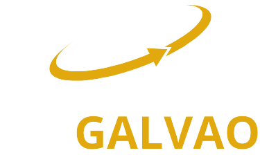

# Portfólio de Warley Galvão



Bem-vindo ao meu portfólio pessoal! Este projeto é uma vitrine digital que apresenta meus trabalhos como desenvolvedor Full Stack, destacando minha expertise em criação de sites modernos, responsivos e dinâmicos. Aqui, você encontrará informações sobre mim, meus serviços, projetos realizados e formas de contato.

## 📋 Sobre o Projeto

Este portfólio foi desenvolvido para demonstrar minhas habilidades em desenvolvimento web, com foco em usabilidade, experiência do usuário (UX) e design responsivo. O site é uma representação visual e interativa do meu trabalho, permitindo que visitantes explorem meus projetos e entrem em contato para oportunidades de colaboração.

### 🎯 Objetivo

- **Apresentar meus serviços**: Desenvolvimento de sites, gestão de tráfego pago, copywriting e design UI/UX.
- **Mostrar projetos**: Destaque para trabalhos realizados, como plataformas de hospedagem, e-commerce e sistemas web.
- **Facilitar contato**: Formulário de contato integrado com EmailJS, além de links para WhatsApp, Instagram e email.
- **Experiência profissional**: Refletir minha abordagem inovadora e focada em eficiência.

## 🛠️ Tecnologias Utilizadas

Este projeto foi construído utilizando tecnologias modernas e acessíveis para garantir performance, responsividade e interatividade:

- **HTML5**: Estrutura semântica e acessível.
- **CSS3**: Estilização personalizada com foco em design responsivo.
- **Bootstrap 5**: Framework CSS para componentes responsivos e utilitários.
- **JavaScript (ES6+)**: Interatividade e funcionalidades dinâmicas.
- **AOS (Animate On Scroll)**: Biblioteca para animações suaves ao rolar a página.
- **EmailJS**: Integração para envio de emails diretamente do formulário de contato.
- **Google Analytics**: Rastreamento de visitantes e conversões.

### Dependências Externas
- [Bootstrap](https://getbootstrap.com/) - v5.3.0
- [AOS](https://michalsnik.github.io/aos/) - v2.3.1
- [EmailJS](https://www.emailjs.com/) - v4.0.0

## 🚀 Como Acessar

Este é um projeto estático, então não requer instalação de dependências ou servidor backend. Para visualizar o portfólio:

1. **Clone o repositório**:
   ```bash
   git clone https://github.com/wrgalvao0/portifolio.git
   ```

2. **Navegue até o diretório**:
   ```bash
   cd portifolio
   ```

3. **Abra o arquivo `index.html`** no seu navegador preferido:
   - Clique duplo no arquivo `index.html` ou
   - Use um servidor local (opcional, mas recomendado para simular produção):
     ```bash
     # Usando Python (se instalado)
     python -m http.server 8000
     # Acesse: http://localhost:8000
     ```

   - Ou use extensões como "Live Server" no VS Code para uma experiência de desenvolvimento.

## 📁 Estrutura do Projeto

```
portifolio/
├── index.html              # Página principal do portfólio
├── css/
│   ├── bootstrap.css       # Estilos do Bootstrap
│   └── home.css            # Estilos personalizados
├── js/
│   ├── bootstrap.js        # Scripts do Bootstrap
│   ├── animacoes/
│   │   └── aos.js          # Configurações de animação AOS
│   └── email/
│       └── email.js        # Configuração EmailJS para formulário
├── img/
│   ├── Banner-principal/   # Imagens do banner
│   ├── foto/               # Fotos pessoais
│   ├── icons/              # Ícones utilizados
│   ├── logo/               # Logo do portfólio
│   └── projetos/           # Imagens dos projetos
└── README.md               # Este arquivo
```

### Descrição dos Diretórios
- **`css/`**: Contém os arquivos de estilo. `bootstrap.css` é o framework principal, enquanto `home.css` inclui customizações específicas do design.
- **`js/`**: Scripts JavaScript. `bootstrap.js` para funcionalidades do Bootstrap, `aos.js` para animações, e `email.js` para envio de formulários.
- **`img/`**: Recursos visuais organizados por categoria para otimização e manutenção.

## 🌟 Projetos em Destaque

### 1. Hospedagem+
Uma plataforma online intuitiva e responsiva para reserva de hotéis. Inclui login seguro, verificação de disponibilidade em tempo real e design moderno.

- **Link**: [Acessar Projeto](https://wrgalvao0.github.io/HospedagemPlus/)
- **Tecnologias**: HTML, CSS, JavaScript, Bootstrap

### 2. Hora Certa
E-commerce especializado em relógios com interface moderna, banners promocionais, galeria de depoimentos e rodapé interativo.

- **Link**: [Acessar Projeto](https://wrgalvao0.github.io/HoraCerta/)
- **Tecnologias**: HTML, CSS, JavaScript, Bootstrap

### 3. Avalia RU Unifesspa
Sistema web para avaliação de refeições no restaurante universitário, desenvolvido como Trabalho de Conclusão de Curso (TCC). Inclui login, cadastro, avaliações e painel administrativo.

- **Link**: [Acessar Projeto](https://github.com/wrgalvao0/TCC_REFEITORIO_FRONT_BACK)
- **Tecnologias**: HTML, CSS, JavaScript, (possivelmente backend não detalhado aqui)

## 📞 Contato

Estou sempre aberto a novas oportunidades e colaborações. Entre em contato:

- **Email**: warleygalvao61@gmail.com
- **WhatsApp**: [(91) 98623-9393](https://wa.me/5591986239393?text=Olá,%20gostaria%20de%20conversar%20sobre%20o%20desenvolvimento%20de%20um%20site!)
- **Instagram**: [@wrgalvao](https://www.instagram.com/wrgalvao/)
- **Telefone**: (91) 98623-9393

### Horários de Atendimento
- **Segunda a Sexta**: 09:00 - 18:00

## 🤝 Serviços Oferecidos

- **Desenvolvimento de Sites**: Sites modernos, responsivos e otimizados.
- **Gestão e Tráfego Pago**: Campanhas estratégicas para atrair clientes.
- **Copywriting**: Textos persuasivos para aumentar conversões.
- **UI/UX Design**: Interfaces intuitivas e funcionais.

Para orçamentos e consultas, utilize o formulário de contato no site ou entre em contato diretamente.

## 📄 Licença

Este projeto é de uso pessoal e não possui licença específica. Todos os direitos reservados a Warley Galvão.

## 🙏 Agradecimentos

Agradeço a todos que visitam meu portfólio e demonstram interesse em meu trabalho. Este projeto reflete minha paixão por desenvolvimento web e meu compromisso com a excelência.

---

**Desenvolvido por Warley Galvão** - Formado em Engenharia da Computação pela Universidade Federal do Sul e Sudeste do Pará.</content>
<parameter name="filePath">c:\Users\wrgal\Documents\MeusProjetos\portifolio\README.md